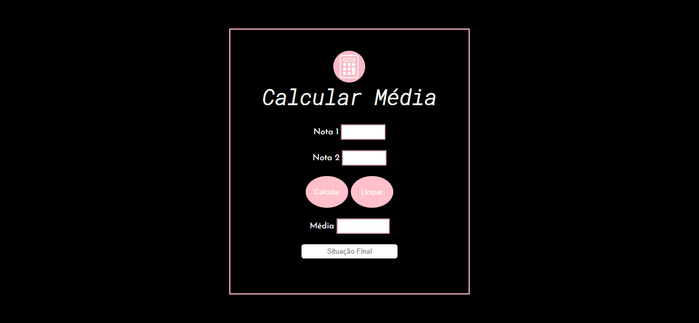

## Average Calculator

<h4 align="center">Uma calculadora de média simples, que gera a média e a situação atual do aluno. Pretendo fazer algumas modificações futuramente, como ter um botão para adicionar/remover outra nota ou mudar o layout para bimestral, trimestral ou semestral.</h4>
<h4 align="center">A simple average calculator, which generates the average and the current situation of the student. I intend to make some changes in the future, such as having a button to add/remove another note or change the layout to bimonthly, quarterly or semi-annually.</h4>
 

<h3 align="center">Em breve postarei novas atualizações | I will post new updates soon</h3>
